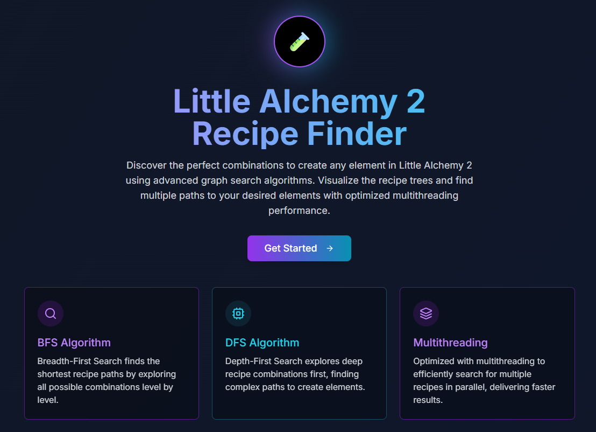

# Tubes2_FE_RecipePlayground

This is the frontend repository for the **Recipe Playground** project. This project provides a User Interface to interact with the backend which implements element recipe search algorithms.

## Overview

This frontend serves as a window for users to:
- Enter the name of the element whose recipe they want to search for.
- Specify the recipe limit (`maxRecipes`).
- Select the search algorithm (DFS or BFS).
- Display the recipe results in an easy-to-read format (likely a tree structure or list).
- Communicate with the backend API to get recipe data.

## Technologies Used

This frontend project is built using the following technologies:

- **Next.js** as the framework
- **Shadcn** as the component-based library
- **React-flow** as node-based library

## Installation and Setup

To run this frontend project locally, follow these steps:

1.  **Clone the repository:**
    ```bash
    git clone https://github.com/fathurwithyou/Tubes2_FE_RecipePlayground.git
    ```
2.  **Navigate to the project directory:**
    ```bash
    cd Tubes2_FE_RecipePlayground
    ```
3.  **Install dependencies:**
    ```bash
    npm install --force
    ```
4.  **Configure API Endpoint:**
    You may need to configure the backend API endpoint URL. Find the configuration file (usually in `.env` or a `config` folder) and adjust your backend URL.

    ```dotenv
    # Example .env file
    PUBLIC_NEXT_API_URL=http://localhost:5000 # Adjust with your backend URL
    ```

## How to Run the Project

After installation is complete and the API endpoint configuration is correct, you can run the project:

```bash
npm start
```

This will run the frontend application in development mode. Open [http://localhost:5000](http://localhost:5000) (or another port shown in the terminal) in your browser to view it.

## Folder Structure

Here is a general overview of the project's folder structure:

```
Tubes2_FE_RecipePlayground/
├── public/         # Static files
├── app
│   ├── globals.css
│   ├── layout.tsx
│   ├── loading.tsx
│   └── page.tsx
├── components
│   └── ui
├── hooks
│   ├── use-mobile.tsx
│   └── use-toast.ts
├── Dockerfile
├── package.json
├── README.md      
```

## Contributors

| Nama | NIM |
|---|---|
| Adiel Rum | 10123004 |
| Muhammad Fathur Rizky | 13523105 |
| Ahmad Wafi Idzharulhaqq | 13523131 |

---

This project was created as part of the **Tubes 2 IF2211 Algorithm Strategy** assignment/project at **Institut Teknologi Bandung**